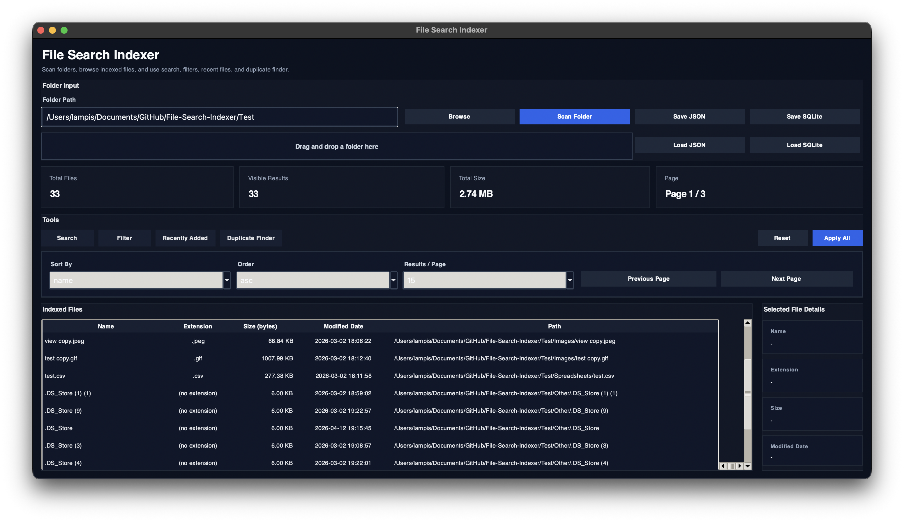
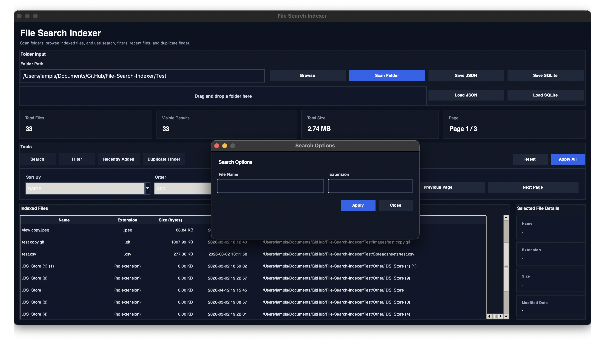
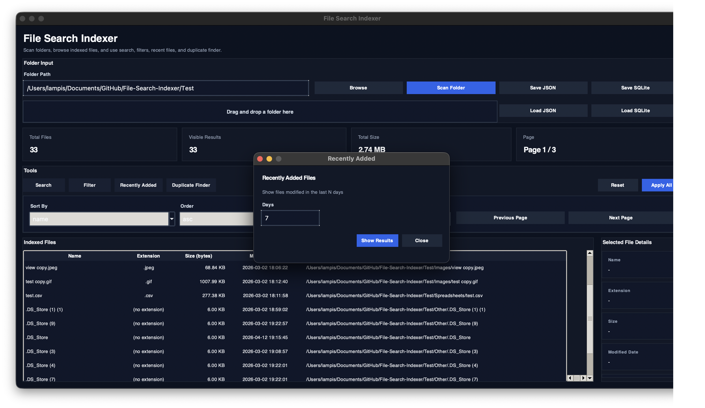
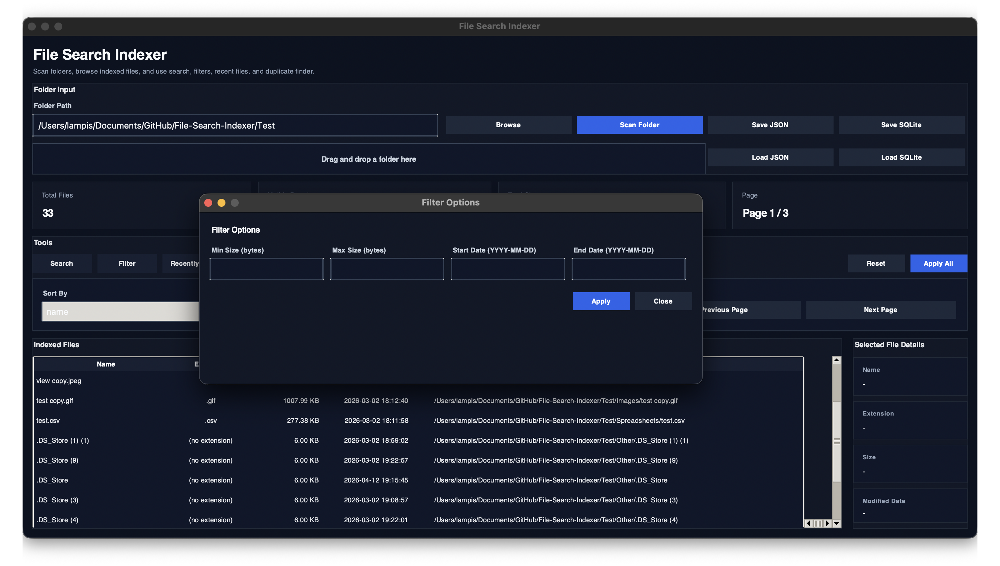
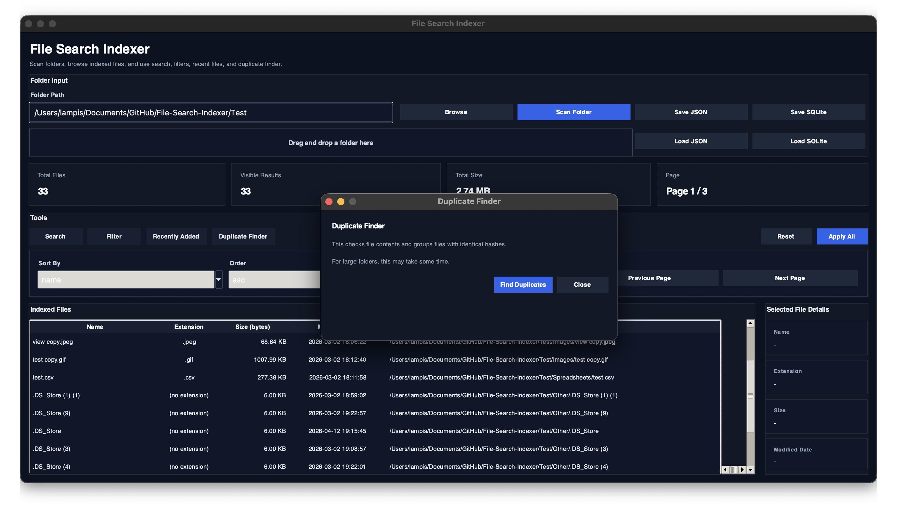

# File Search Indexer

## Description
This project is a local file indexing tool built in Python. It recursively scans folders and subfolders, collects file metadata such as path, name, size, extension, and modified date, and allows fast file searching and filtering.

The application supports both a command-line interface (CLI) and a graphical user interface (GUI), making file management easier and more organized.

## Getting Started
1. Download or clone the project files.
2. Install the required Python packages if needed.

Keep in mind that the project is developed using an **object-oriented programming (OOP)** approach.

### 1) macOS app (`.app`)

- Download the provided **FileSearchIndexer.zip**
- Unzip the file
- Open the generated **FileSearchIndexer.app**
- Use the graphical interface to select a folder, drag and drop one, or browse for it manually
- Scan the folder and use the available GUI features such as search, filter, sorting, pagination, recently added files, and duplicate finder

> **Note:** The macOS application is designed for direct use without running Python manually. The generated JSON and SQLite index files are stored in the standard macOS application data location:
>
> `~/Library/Application Support/FileSearchIndexer/`

---

### 2) Run from source (Python / CLI)

- Download or clone the full project folder
- Open a terminal in the project directory
- Move into the `Source_Code` folder
- Run the CLI version from the command line

```bash
python main.py
# or
python3 main.py
```
> **Note:** The CLI version allows you to scan folders and use the available options for search, filtering, sorting, pagination, and viewing scan issues directly from the terminal.

## User Interface Overview



The application provides a graphical user interface for indexing and searching local files in a simple and user-friendly way. The main window is organized into clear sections so the user can select a folder, scan its contents, apply search and filter options, browse indexed results, and inspect file details in an organized layout.



At the top of the interface, the user can choose a folder either through drag and drop or by using the **Browse** button. After selecting a folder, the user can start the indexing process with the **Scan Folder** button. The same area also includes options for saving and loading index data in **JSON** and **SQLite** format.



The interface also includes a tools section for working with the indexed data. Through the GUI, the user can open separate windows for **Search** and **Filter** options, apply sorting preferences, control pagination, view recently added files, and run the duplicate finder feature. This makes navigation through large sets of indexed files more practical and structured.



The main results area displays all indexed files in a table format. For each file, the application shows useful metadata such as file name, extension, size, modified date, and full path. The results can be sorted and browsed page by page, making the interface easier to use even when many files are indexed.



On the right side of the window, the application provides a details panel for the currently selected file. This section displays the selected file’s name, extension, size, modified date, and full path. It also provides quick actions such as opening the selected file directly or copying its path.

Overall, the GUI combines folder scanning, indexing, searching, filtering, sorting, pagination, and file inspection in one environment, making local file management more practical and accessible for the user.